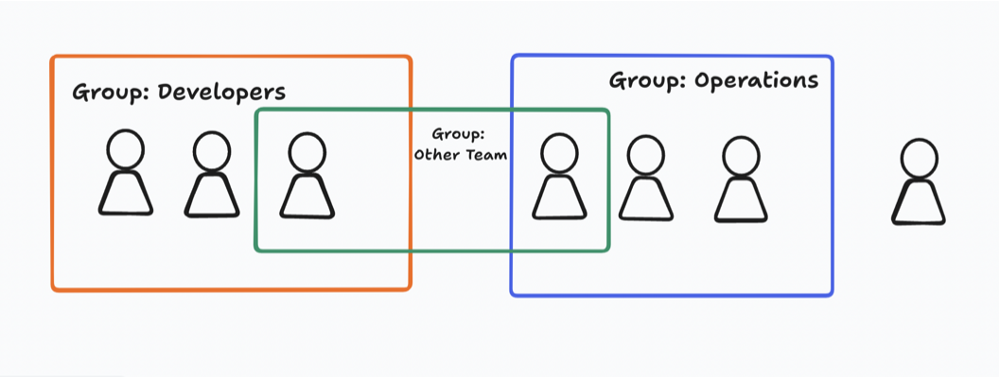

# Identity and Access Management

A global service.

## Users and Groups

- Root account created by default (shouldn't be used or shared).
- Users are people within your organisation and can be grouped (or not).
- Groups only contain users.



## Permissions

- Users or groups can be assigned JSON documents called policy permissions.
- Use **least privilege principle**.

```
{
  "Version": "2012-10-17",
  "Statement": [
    {
      "Effect": "Allow",
      "Action": "ec2:Describe*",
      "Resource": "*"
    },
    {
      "Effect": "Allow",
      "Action": "elasticloadbalancing:Describe*",
      "Resource": "*"
    },
    {
      "Effect": "Allow",
      "Action": [
        "cloudwatch:ListMetrics",
        "cloudwatch:GetMetricStatistics",
        "cloudwatch:Describe*"
      ],
      "Resource": "*"
    }
  ]
}

```
